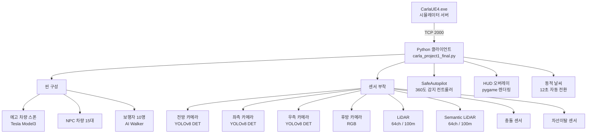
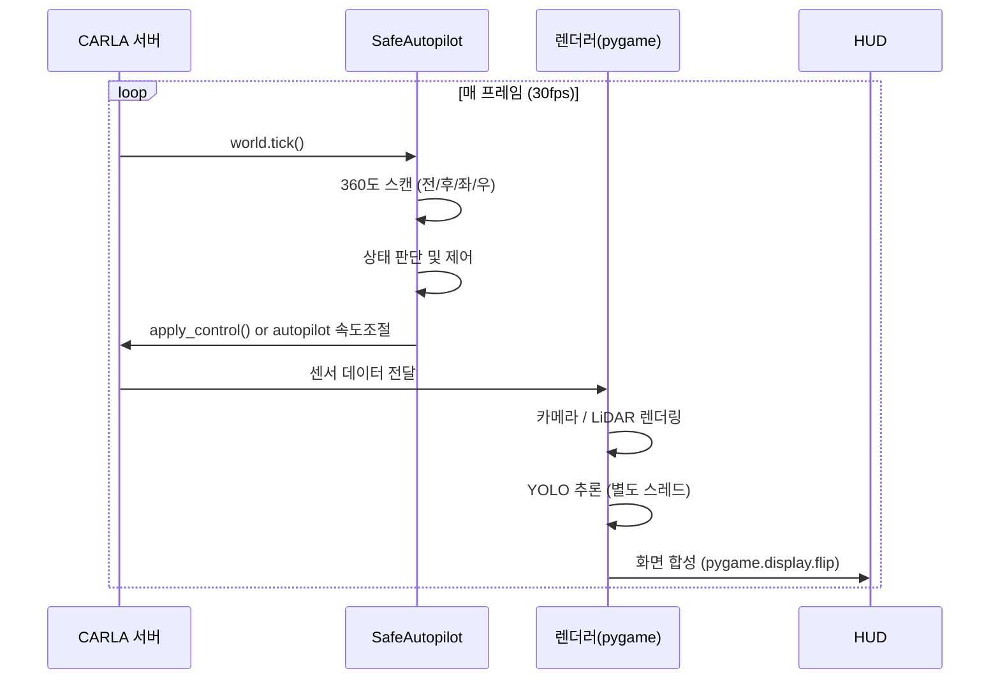
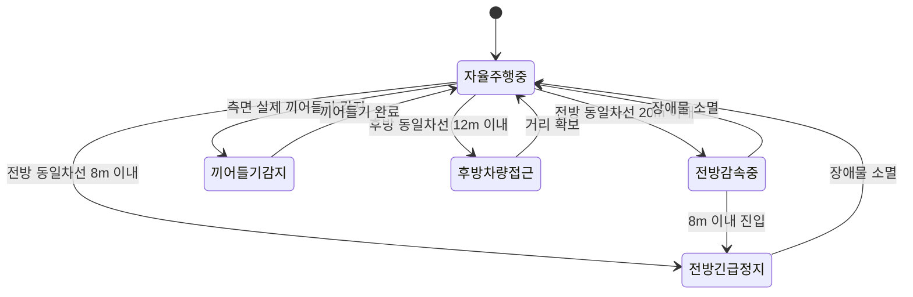
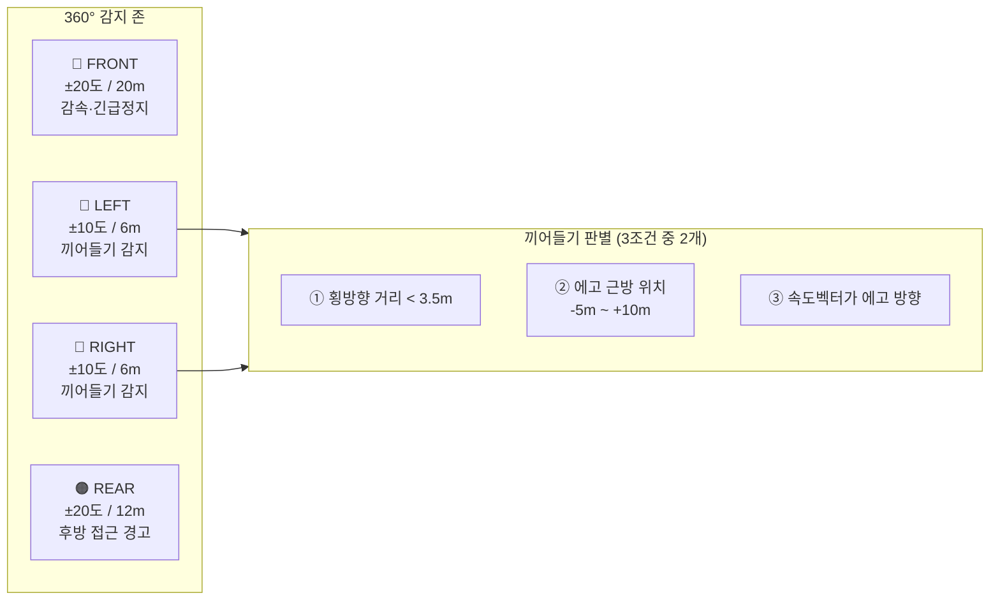
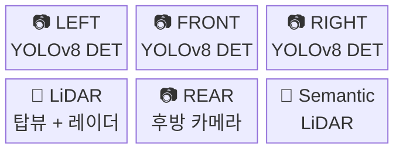
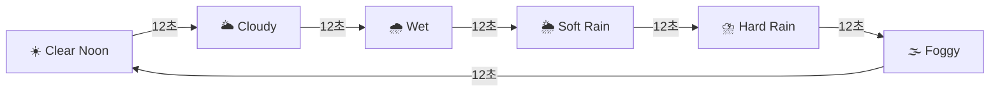
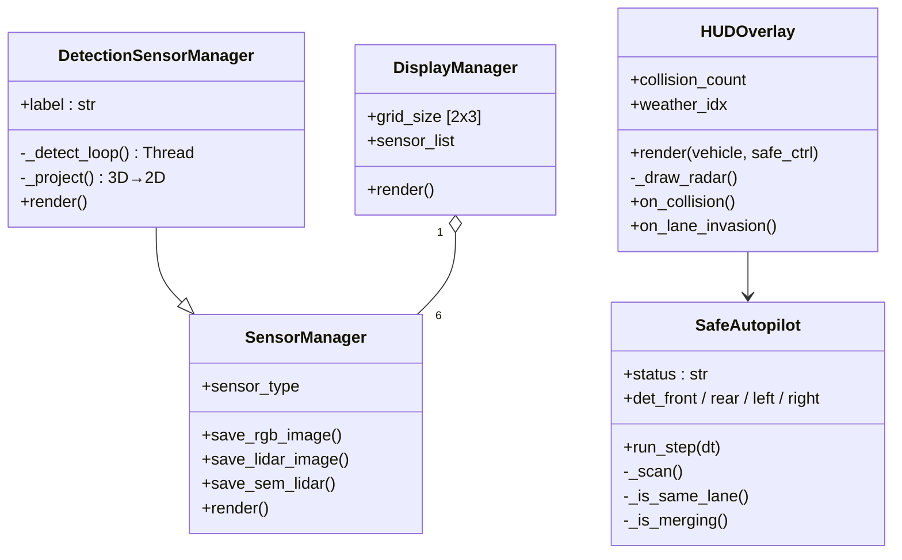

# 🚗 Capstone Design — CARLA 0.9.16 자율주행 시뮬레이터

> CARLA 시뮬레이터 기반 자율주행 + 실시간 멀티센서 퓨전 + YOLOv8 객체 인식 데모

---

## 📌 프로젝트 개요

| 항목 | 내용 |
|---|---|
| 시뮬레이터 | CARLA 0.9.16 (Unreal Engine 4 기반) |
| 언어 | Python 3.12 |
| 핵심 라이브러리 | carla, pygame, numpy, ultralytics (YOLOv8), opencv |
| 자율주행 방식 | CARLA Traffic Manager Autopilot |
| 객체 인식 | YOLOv8n (사람·차량 클래스 한정) |
| NPC | 차량 15대 + 보행자 10명 |

---

## 🗺️ 전체 시스템 구조

---

## 🔄 메인 루프 동작 순서

---

## 🧠 SafeAutopilot 상태 머신

---

## 📡 360도 감지 존

---

## 🖥️ 화면 레이아웃

**HUD 정보 (하단 오버레이)**
- 속도계 (km/h) + 게이지 바
- 주행 상태 텍스트 (감속 / 정지 / 끼어들기 등)
- 360° 레이더 미니맵
- FPS / 날씨 / 충돌 횟수 / 방향별 감지 거리
- 충돌 시 전체화면 빨간 플래시
- 차선이탈 경고 배너

---

## 🎨 바운딩박스 색상 기준

| 색상 | 의미 |
|---|---|
| 🔴 빨강 (굵은 테두리) | 위험 감지 존 액터 |
| 🟣 보라 | 보행자 |
| 🟠 주황 | 10m 이내 근접 차량 |
| 🟡 노랑 | 10~25m 주의 차량 |
| 🟢 초록 | 25m 이상 안전 거리 |

---

## 🌦️ 동적 날씨 사이클

---

## 📦 주요 클래스 구성

